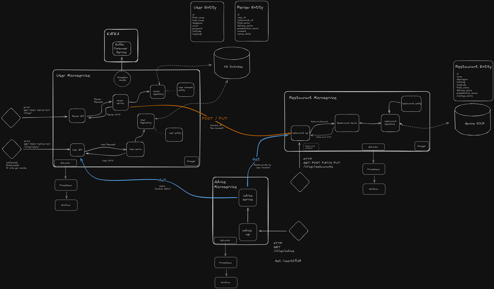

# ONLINE FOOD ORDER APP
## Genel Bakış

Bu proje, bir online yemek sipariş ve teslim platformunu simüle eden kapsamlı bir mikroservis mimarisidir. Farklı servislerin bir mikroservis ekosisteminde nasıl etkileşime girebileceğini,
kullanıcı yönetimi, restoran hizmetleri, inceleme işleme, kullanıcı konumuna dayalı tavsiye sağlamak için tasarlanmıştır. 
Sistem, her mikroservisin izole edilmiş, ölçeklenebilir ve kolayca dağıtılabilir olduğunu garanti eden Docker'ı konteynerizasyon için kullanır.

## Mimari

Mimari, ölçeklenebilirlik, dirençlilik ve servisler arası gevşek bağlantı üzerine odaklanmıştır. Her servis Docker kullanılarak konteynerize edilmiş olup, kolay dağıtım ve ölçeklendirme sağlar.
Servisler RESTful API'lar ve Kafka konuları üzerinden asenkron mesajlaşma sağlayarak yüksek kullanılabilirlik ve hata toleransı sunar. Sistem, güvenli ve verimli servisler arası iletişimi kolaylaştırmak için 
bir servis ağı kullanır.

- **User Service**: Kayıt, güncelleme ve silme dahil kullanıcı hesaplarını yönetir. Kullanıcılar, id'lere göre bulunup yönetilebilir.
- **Restaurant Service**: Restoranların açıklamalarını ve konumlarını içerir. Yakındaki restoranları bulmak için verimli arama ve mekansal sorgular yapmak üzere **Apache Solr** kullanır.
- **Advice Service**: Kullanıcı konumlarına dayalı olarak kullanıcılara kişiselleştirilmiş restoran önerileri sağlar, Kullanıcı ve Restoran servislerinden veri alır.
- **Review Service**: Kullanıcıların restoranlar için inceleme yazmalarını, güncellemelerini ve silmelerini sağlar. İncelemeler, kullanıcı geri bildirimlerine dayanarak restoranların dinamik puanlanmasına katkıda bulunur.
- **Kafka Service**: Kafka kullanılarak alınan hataları işler.
- **Prometheus ve Grafana ile İzleme**: Servislerin sağlığını ve performansını izlemek için metrikleri takip etmeyi ve görselleştirmeyi sağlar.

## Restoran Değerlendirme ve Öneri Sistemi İş Akışı
### Yorum Puanlarının İşlenmesi:

- Kullanıcılar, bir restoran için yorum yapar ve bu yorumlar içinde yemeğin kalitesi, teslimatın hızı ve sunumun kalitesi gibi çeşitli puanlamalar yer alır. Bu puanlar; yiyecek puanı (food score), teslimat puanı (delivery score) ve sunum puanı (presentation score) olarak adlandırılır.
- Yeni bir yorum yapıldığında veya var olan bir yorum güncellendiğinde, bu puanlar restoran servisine restoranın ID'si ile birlikte gönderilir.
- Eğer bir yorum güncellenirse, kullanıcının güncellenen puanları arasındaki farka bakılır. Eğer puanlarda bir fark varsa, bu fark restoran servisine bildirilir.
- Restoran servisinde, yeni yorum puanları ilgili restoranın kaydını güncellerken, eğer bir yorum güncellenmişse, yeni ve eski puanlar arasındaki fark hesaplanır ve bu farka göre güncelleme yapılır ancak yorum sayısı artırılmaz.

### Restoran Önerileri:
- Öneri servisi (advice service), bir kullanıcıya restoran önerisi yapmadan önce, kullanıcının konum bilgilerini almak için kullanıcı servisine (user service) başvurur.
- Alınan konum bilgileri ile restoran servisine istek atılır. Restaurant servisi kullanıcının bulunduğu konuma en yakın 10 kilometre içerisindeki restoranları bulmak için Solr arama motorunu kullanarak sorgu yapar. 

``
  fq={!geofilt sfield=location pt=?0,?1 d=10}
``
- Bu sorgu, kullanıcının tam konumunu (latitude, longitude) ve aranacak maksimum mesafeyi (10 km) parametre olarak alır.
- Restoran servisinden gelen veriler, öneri servisine iletilir.
- Öneri servisi, kullanıcının konumu ile her bir restoran arasındaki mesafeyi Haversine formülü ile hesaplar. Sonra, restoranların uzaklığına %30, ortalama puanlarına ise %70 ağırlık vererek her bir restoran için bir puan hesaplar.
- Hesaplanan puanlara göre, en iyi skoru alan ilk 3 restoran, kullanıcıya öneri olarak sunulur.
## Teknolojiler ve Araçlar

- Spring Boot: 3.2.3
- Docker: 4.11.1
- Apache Kafka
- Apache Solr: 4.3.14
- Prometheus ve Grafana

## Başlarken

Projeyie başlatmak için, repoyu yerel makinenize klonlayın. Docker ve Docker Compose'un yüklü olduğundan emin olun. Proje dizinine gidin ve servisleri oluşturmak ve başlatmak için Docker Compose kullanın:

``
docker-compose up --build -d
``

## Temel Endpoint'ler

### User Service
http://localhost:8081/swagger-ui/index.html#/
- GET /api/v1/users: Tüm kullancıları getirir.
- GET /api/v1/users/{id}: Belirli bir ID'ye sahip kullanıcıyı getirir.
- GET /api/v1/users/location/{id}: Belirli bir ID'ye sahip kullanıcının konum bilgisini getirir.
- POST /api/v1/users: Yeni bir kullanıcı oluşturur.
- PUT /api/v1/users: Mevcut bir kullanıcıyı günceller.
- DELETE /api/v1/users/{id}: Belirli bir ID'ye sahip kullanıcıyı siler.
- 
### Review Service
http://localhost:8081/swagger-ui/index.html#/
- GET /api/v1/reviews: Tüm yorumları getirir.
- GET /api/v1/reviews/{id}: Belirli bir ID'ye sahip yorumu getirir.
- GET /api/v1/reviews/userId/{id}: Belirli bir ID'ye sahip kullancının yorumlarını getirir.
- GET /api/v1/reviews/restaurantId{id}: Belirli bir ID'ye sahip restaurantın yorumlarını getirir.
- POST /api/v1/reviews: Yeni bir yorum oluşturur.
- PUT /api/v1/reviews: Mevcut bir yorumu günceller.
- DELETE /api/v1/reviews/{id}: Belirli bir ID'ye sahip yorumu siler.

### Restaurant Service
http://localhost:8080/swagger-ui/index.html#/
- GET /api/v1/restaurants: Tüm restoranları getirir.
- GET /api/v1/restaurants/{id}: Belirli bir ID'ye sahip restaurantı getirir.
- GET /api/v1/restaurants/nearby: Kullanıcının konumuna göre yakındaki restoranları listeler.
- POST /api/v1/restaurants: Yeni bir restoran oluşturur.
- POST /api/v1/restaurants/score/{id}: Restauranta gelen yorumun puanlarını kaydeder.
- PUT /api/v1/restaurants: Mevcut bir restoranı günceller.
- PUT /api/v1/restaurants/score/{id}: Güncellenen yorumu update eder.
- DELETE /api/v1/restaurants/{id}: Belirli bir ID'ye sahip restaurantı siler.

### Advice Service
http://localhost:8082/swagger-ui/index.html#/
- GET /api/v1/advices/userId/{id}: Belirli bir kullanıcı ID'si için önerilen restoranları listeler. (10 km içerisindeki, kullanıcı için en yüksek uygunluktaki restaurantlar)

### Solr
http://localhost:8983/solr

### Kafka Database
http://localhost:8083/h2-console/login.do?jsessionid=d8e3fa1b6412c2769c3137723dc24a00

### Grafana 
http://localhost:3000/login

### Prometheus
http://localhost:9090

